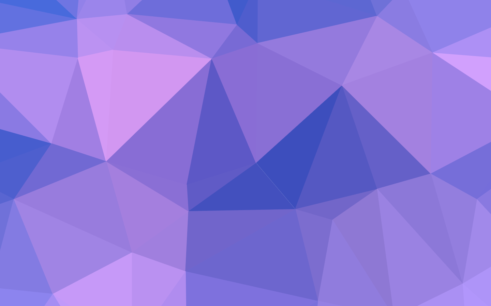

  

# Hello, I’m Loke.

I build ideas with personality — from a rough sketch to something people can use, share, and remember.

  
  

> The best projects leave a little room for surprise.

|  |  |
| --- | --- |
| **I care about**  Useful ideas, strong visual systems, and the details people feel. | **Outside the editor**  Collecting references, learning in public, and following a good tangent. |

## Things I’m exploring

### [A playful side project](https://github.com/)

A small idea with a clear point of view and just enough ambition.

### [A favourite collaboration](https://github.com/)

What we made together and the role I played in shaping it.

A few more things about me

Use this space for the notes, links, or personal details that do not need to lead the page — but make it feel more like yours.

<!-- Profile crafted with GitDash Studio: https://gitdash.dev/studio -->
