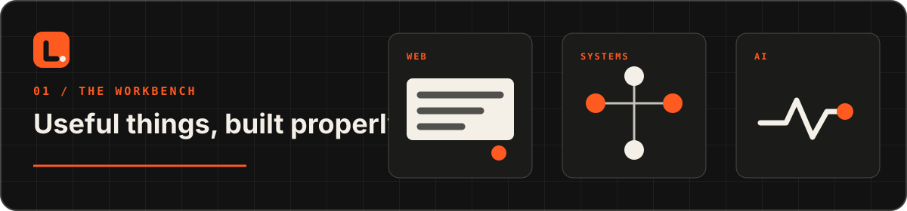

  

  <a href="https://loke.dev">loke.dev</a>
  &nbsp;·&nbsp;
  <a href="https://github.com/loke-dev?tab=repositories">GitHub projects</a>
  &nbsp;·&nbsp;
  <a href="https://x.com/loke_dev">X</a>
  &nbsp;·&nbsp;
  <a href="https://loke.dev/contact">Contact</a>

## Hey, I’m Loke

I’m an independent developer in Sweden. I make websites, tools, and software for the web. I like work that feels useful on day one and stays understandable six months later.

My usual mix is product UI, TypeScript, cloud platforms, CMS work, AI features, and the checks that keep a release from becoming a surprise.
