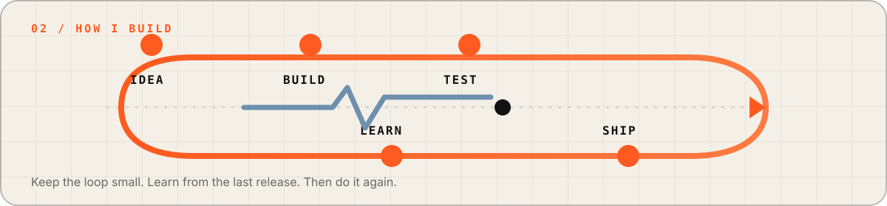

  

  <a href="https://loke.dev">loke.dev</a>
  &nbsp;·&nbsp;
  <a href="https://github.com/loke-dev?tab=repositories">GitHub projects</a>
  &nbsp;·&nbsp;
  <a href="https://x.com/loke_dev">X</a>
  &nbsp;·&nbsp;
  <a href="https://loke.dev/contact">Contact</a>

## Hey, I’m Loke

I’m an independent developer in Sweden. I make websites, tools, and software for the web. I like work that feels useful on day one and stays understandable six months later.

My usual mix is product UI, TypeScript, cloud platforms, CMS work, AI features, and the checks that keep a release from becoming a surprise.

## Selected work

  

| Project | What it does |
| --- | --- |
| [**Workers Doctor**](https://workers-doctor.loke.dev) | Inspect and safely run multi-Worker Cloudflare projects. |
| [**DeployProof**](https://deployproof.loke.dev) | Check that a preview behaves like production before deploy. |
| [**FlareCheck**](https://flarecheck.loke.dev) | Find production risks in Cloudflare Worker configuration. |
| [**Angrboda**](https://angrboda.loke.dev) | A red and violet theme system for editors, terminals, browsers, and AI tools. |
| [**expect-fetch**](https://github.com/loke-dev/expect-fetch) | Vitest matchers for native Fetch API responses. |
| [**Shuffleworks**](https://shuffle.loke.dev) | Small random-selection tools for teams, games, and chance. |

## How I work

- Start with the actual problem, not the framework.
- Keep the first version small enough to finish.
- Test the risky parts before polishing the edges.
- Make the boring path clear for the next person.

I write about the same kind of work on [loke.dev](https://loke.dev), with practical guides, tools, comparisons, and notes from things I have actually built.

## What I am into right now

- Small developer tools that remove annoying setup work.
- AI features with clear limits and useful checks.
- Fast websites with content that is easy to update.
- Open source packages that do one job well.

## Find me elsewhere

- [loke.dev](https://loke.dev) for projects, writing, tools, and services.
- [GitHub](https://github.com/loke-dev) for code and experiments.
- [X](https://x.com/loke_dev) for shorter thoughts and work in progress.
