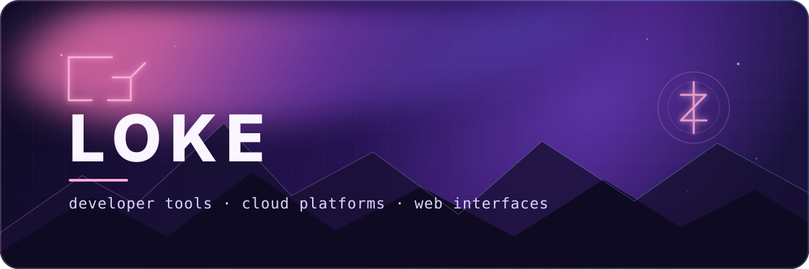
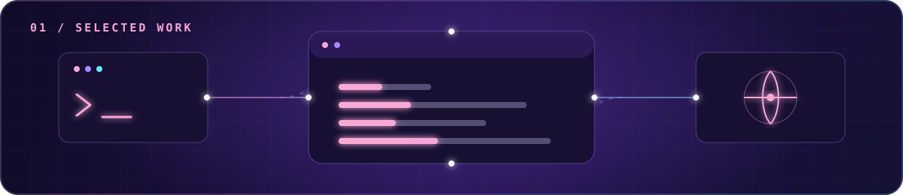
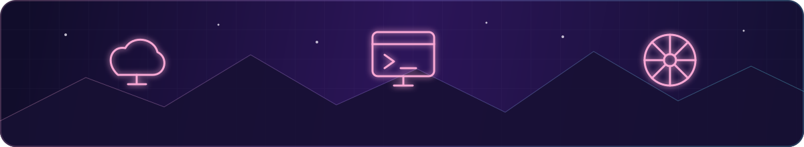
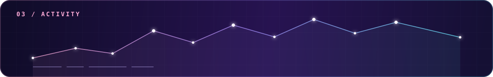

  

  Developer based in Sweden. 
  TypeScript, Cloudflare infrastructure, developer tools, and focused web products.

  <a href="https://loke.dev">Website</a>
  &nbsp;&nbsp;·&nbsp;&nbsp;
  <a href="https://github.com/loke-dev?tab=repositories">Repositories</a>
  &nbsp;&nbsp;·&nbsp;&nbsp;
  <a href="https://x.com/loke_dev">X</a>

 

  

<table>
  <tr>
    <td width="50%" valign="top">
      <h3><a href="https://workers-doctor.loke.dev">Workers Doctor</a></h3>
      
Inspect and safely run multi-Worker Cloudflare projects.

      Cloudflare Workers · TypeScript · <a href="https://github.com/loke-dev/workers-doctor">Source</a>
    </td>
    <td width="50%" valign="top">
      <h3><a href="https://deployproof.loke.dev">Deployproof</a></h3>
      
Verify that a preview behaves like production before deployment.

      CI/CD · GitHub Actions · <a href="https://github.com/loke-dev/deployproof">Source</a>
    </td>
  </tr>
  <tr>
    <td width="50%" valign="top">
      <h3><a href="https://flarecheck.loke.dev">Flarecheck</a></h3>
      
Production-readiness checks for Cloudflare Workers projects.

      Configuration · CLI · <a href="https://github.com/loke-dev/flarecheck">Source</a>
    </td>
    <td width="50%" valign="top">
      <h3><a href="https://angrboda.loke.dev">Angrboda</a></h3>
      
A red and violet theme system for editors, terminals, browsers, and AI tools.

      Design systems · Themes · <a href="https://github.com/loke-dev/Angrboda">Source</a>
    </td>
  </tr>
  <tr>
    <td width="50%" valign="top">
      <h3><a href="https://github.com/loke-dev/expect-fetch">Expect Fetch</a></h3>
      
Vitest matchers for native Fetch API responses.

      Vitest · Fetch API · TypeScript
    </td>
    <td width="50%" valign="top">
      <h3><a href="https://shuffle.loke.dev">Shuffleworks</a></h3>
      
Shuffle, dice, and random-selection tools for teams and games.

      Vite · TypeScript · <a href="https://github.com/loke-dev/shuffleworks">Source</a>
    </td>
  </tr>
</table>

 

  

<table>
  <tr>
    <td width="33%" valign="top">
      <strong>Cloud tooling</strong>
      
Local development, configuration analysis, deployment checks, and CI for Cloudflare Workers.

    </td>
    <td width="33%" valign="top">
      <strong>Web interfaces</strong>
      
Astro, Svelte, React, design systems, and small interaction-focused products.

    </td>
    <td width="33%" valign="top">
      <strong>Open source</strong>
      
TypeScript packages, testing utilities, starters, and documentation.

    </td>
  </tr>
</table>

  TypeScript &nbsp;·&nbsp; Cloudflare Workers &nbsp;·&nbsp; Astro &nbsp;·&nbsp; Svelte &nbsp;·&nbsp; React &nbsp;·&nbsp; Vitest

 

  

  

  
    <a href="https://github.com/loke-dev/sveltekit-mdsvex-blog-template">SvelteKit MDsveX Blog</a>
    &nbsp;·&nbsp;
    <a href="https://github.com/loke-dev/awesome-gridsome">Awesome Gridsome</a>
    &nbsp;·&nbsp;
    <a href="https://github.com/loke-dev/astro-landing-page-template">Astro Landing Page</a>
  

 

  

